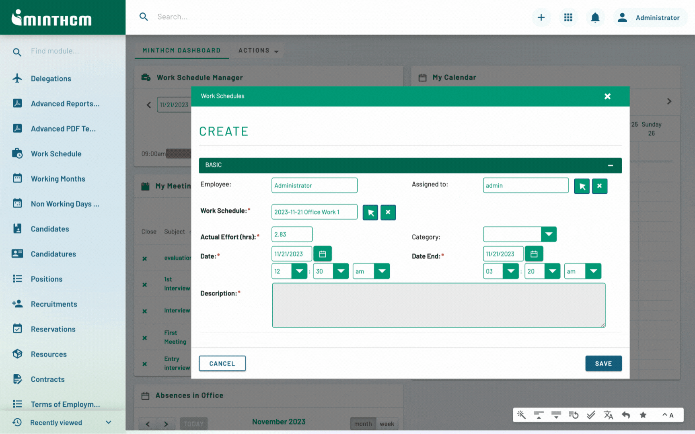

# MintHCM CI/CD pipeline

Deploy MintHCM server with CI/CD on Elestio

 
 

# Once deployed ...

You can open MintHCM here:

    URL: https://[CI_CD_DOMAIN]/admin
    login: admin
    password: [ADMIN_PASSWORD]

You can open phpMyAdmin here:

    URL: https://[CI_CD_DOMAIN]:63531
    login: root
    password: [ADMIN_PASSWORD]
